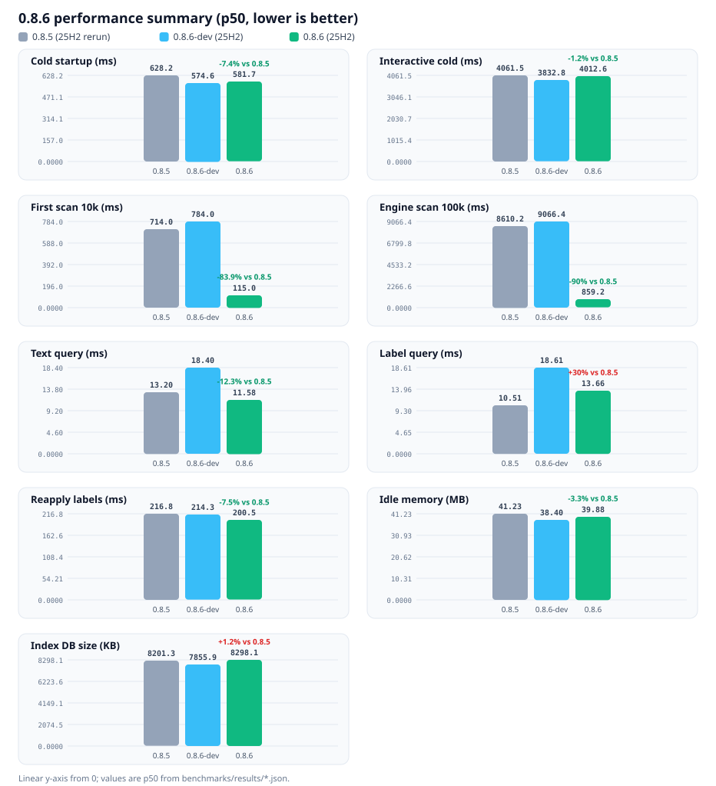
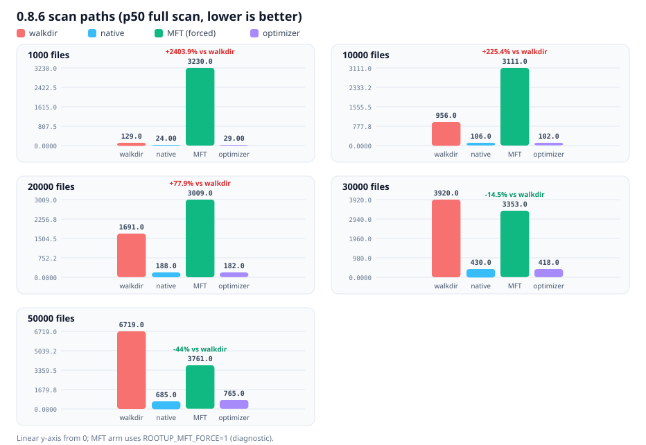

<p align="center">
  
</p>

<h1 align="center">RootUp</h1>

<p align="center"><strong>把散落的文件，变成随找随到的秩序。</strong></p>

<p align="center">
  <a href="https://github.com/54shitaimzf/RootUp/actions/workflows/ci.yml">
    
  </a>
</p>

下载完的课件、写到一半的作业、解压出来的项目，散落在桌面和下载文件夹的各个角落，要用的时候翻半天——RootUp 就是为这件事准备的。它会看着你指定的文件夹，新文件自动分类、一出现就能搜到，一键归档，而且每一次归档都能反悔。

## 核心功能

### 文件整理与搜索

- **自动分类**：新文件进入监控目录后自动按类型归位——文档、图片、视频、音频、压缩包、代码、安装包、数据；也支持自定义标签，显示名、图标、颜色都由你定。
- **实时索引**：文件一出现就能搜到。扫描速度经过重点优化：首次扫描 1 万个文件约 0.1 秒，10 万个不到 1 秒（完整数据见下文性能一节）；课程名称会自动成为标签，资料跟着课程走。
- **强搜索**：输入文字按文件名、路径查找，也可以用条件语法组合筛选（见下文搜索语法）；输入时自动补全，常用筛选条件一键点选。
- **响应快**：10 万文件的库里搜索、翻页依然是毫秒级，列表滚动顺畅，文件再多也不卡。
- **规则与方案**：忽略规则和分类映射都能改，内置默认 / 编程开发 / 素材创作三套模板，也可以把改好的配置存成方案，随时套用。

### 安全归档，随时反悔

- 单个文件、批量勾选、筛选结果、整个项目都能归档；项目归档时，桌面快捷方式自动跟着更新。
- 可选的「自动归档」只处理分类明确的新文件，默认关闭。
- 每一次归档都有记录，一键撤销。

> ⚠️ **安全提醒**：归档是「移动」操作，不是复制。**不要归档系统目录（Windows / Program Files / ProgramData / System32 等）、已安装软件的目录或正在运行程序的文件**——整树移动会破坏软件依赖的绝对路径（注册表、配置、快捷方式），可能导致软件损坏。RootUp 已有的保护：拒绝覆盖与跨盘、提示文件占用、只归档已索引的文件；v0.8.8 将加入系统 / 软件目录保护、归档预检与整树移动风险报告。归档前请确认目录归属，误操作可在一键撤销中恢复。

### 学业管理

- **课程表**：周视图时间轴，支持单双周与指定周次；同时段的课自动叠放，点击即可铺开查看。学期即课表，可新建、编辑、复制、删除。
- **作业管理**：按截止时间排序，支持按状态、课程筛选；短备注与详情、逾期和剩余天数提示、勾选完成。
- **截止提醒**：可选提前 N 天提醒（默认关闭）。提示出现在学业页与作业列表分组里，托盘图标带红点角标，点击直达；另有「打开未完成作业」桌面快捷方式。

### 项目识别与智能打开

- 自动识别 15 种常见项目类型（Rust、Node、Python、Java、C#、Go、Unity、C++、PHP、Ruby、Dart、Flutter、Kotlin、Swift、Android 等）。
- 自动发现 VS Code、Cursor、JetBrains、MATLAB、Typora、Obsidian 等工具，文件行上一键打开、定位、用 IDE 打开。
- 桌面快捷方式双击即可唤起 RootUp 直达项目。

### 桌面体验

- 常驻系统托盘：左键打开主窗口，菜单直达临期作业、切换主题与自动归档；有临期或逾期作业时图标带红点角标。
- 点关闭可以选择「后台运行」：不占浏览器内存，随时从托盘唤回；也可以直接退出，选择会被记住。
- 浅色 / 深色 / 跟随系统主题，中文 / English 界面随时切换。
- 首次启动有欢迎引导，内置帮助中心；常用目录一键添加，支持文件夹拖拽。
- 文件列表可按名称 / 类型 / 大小 / 修改时间 / 标签排序，翻页加载时滚动位置不跳。

## 搜索语法

搜索框是文件页的核心入口：输入文字按文件名/路径查找，输入语法按条件筛选；自动补全与常用 chips 让大部分筛选不用手打。

| 语法 | 含义 | 示例 |
| --- | --- | --- |
| `type:` | 按扩展名 | `type:pdf` |
| `label:` | 按标签 | `label:document` |
| `state:` | 按状态 | `state:pending` |
| `size:` | 按大小 | `size:>10MB` |
| `before:` / `after:` | 按修改时间 | `before:2026-08-01` |
| `+label:` / `AND` | 按标签且需同时满足 | `label:高数 +label:物理` |

- 多个条件可组合，如 `type:pdf 高数`（同时满足）。
- 同一维度多个标签默认为「命中其一」，如 `label:math label:english`（满足其一即可）；需要同时命中时用 `+label:` 或 `AND`。
- 完整语法说明见搜索框右侧的「?」按钮。

## 快速上手

1. 安装 RootUp（见下文），启动后按引导添加要整理的文件夹（下载、桌面、文档等）。
2. 首次扫描完成后，文件页即可搜索与筛选。
3. 可选：开启自动归档、编辑分类规则，或在学业页建立课程表。
4. 一切归档均可撤销，放心整理。

## 性能

RootUp 的扫描、搜索、归档全部在本地完成，速度是 0.8.6 版本重点打磨的方向。以下为 0.8.6 官方基线（Windows 11 25H2 本机实测，p50，0.8.5 也在同一系统复测）：

| 指标 | 0.8.5（25H2 复测） | 0.8.6-dev | 0.8.6 | 对比 0.8.5 |
| --- | --- | --- | --- | --- |
| 冷启动 | 628.2 ms | 574.6 ms | 581.7 ms | -7.4% |
| 首次扫描 10k | 714.0 ms | 784.0 ms | 115.0 ms | -83.9% |
| 引擎扫描 10k | 906.6 ms | 854.3 ms | 101.1 ms | -88.8% |
| 引擎扫描 100k | 8610.2 ms | 9066.4 ms | 859.2 ms | -90.0% |
| 文本查询（100k 库） | 13.2 ms | 18.4 ms | 11.6 ms | -12.3% |
| 标签查询（100k 库） | 10.5 ms | 18.6 ms | 13.7 ms | +30.0%（见说明） |
| 翻页单页 | 0.112 ms | 0.117 ms | 0.074 ms | -33.4% |
| 重分类（100k） | 216.8 ms | 214.3 ms | 200.5 ms | -7.5% |
| 可交互耗时（冷） | 4061.5 ms | 3832.8 ms | 4012.6 ms | -1.2% |
| 空闲内存占用 | 41.2 MB | 38.4 MB | 39.9 MB | -3.3% |
| 索引库体积（10k） | 8.2 MB | 7.9 MB | 8.3 MB | +1.2% |



### 扫描路径四态对比（管理员实测，p50）

扫描内部有几条实现路径，程序会按目录规模自动选择。下表是各路径强制模式下的单独对比：

| 规模 | walkdir | native | MFT（强制） | 优化器 |
| --- | --- | --- | --- | --- |
| 1k | 129 ms | 24 ms | 3230 ms | 29 ms |
| 10k | 956 ms | 106 ms | 3111 ms | 102 ms |
| 20k | 1691 ms | 188 ms | 3009 ms | 182 ms |
| 30k | 3920 ms | 430 ms | 3353 ms | 418 ms |
| 50k | 6719 ms | 685 ms | 3761 ms | 765 ms |



原生枚举在 50k 内全面占优；MFT 有全卷读取的固定成本（约 2.5–4 秒），本机交叉点在更大规模，因此 0.8.6 默认走原生，优化器按目录规模在更大目录才切换 MFT（0.8.7 落地阈值自动化与提权链路）。四态一致性：每档四态 discovered 全等、errors=0、DB 路径/大小/时间集合严格一致。

说明：

- 扫描是本版提升最大的部分：首次扫描 1 万文件快 84%、10 万文件快 90%，真实桌面 7 万文件实测约快 4 倍。
- 可交互耗时（冷启动到能操作）与 0.8.5 基本持平：页面改为按需加载，不影响首屏。
- 「标签查询」比 0.8.5 复测慢 30%、比 0.8.6 开发版快 27%：这一轮收窄了索引集合，相关评估与后续计划（0.8.7 用 FTS / 标签索引收敛）见 benchmarks 文档。
- 前端主包 gzip 约 105 KB（含文件页）；0.8.5 的 151.8 KB 为单包口径，构建方式不同，仅作参考。

完整的 63 项指标、逐版本对比与趋势图见 [benchmarks/README.md](benchmarks/README.md)；原始结果 JSON 见 [benchmarks/results/](benchmarks/results/)。

## 安装

- 从 [GitHub Releases](https://github.com/54shitaimzf/RootUp/releases) 下载 `RootUp_0.8.6_x64-setup.exe`。
- per-user 安装，无需管理员权限，安装时可选中文或 English。
- 安装包未做数字签名，Windows SmartScreen 首次运行会提示「未知发布者」，选择「仍要运行」即可，功能不受影响。
- 需要 WebView2 运行时（Windows 10/11 一般已内置，缺失时安装器会引导下载）。

## 路线图

- **v0.8.5（已发布）**：查询提速——搜索与翻页快了 70% 以上，新增「标签同时满足」语法（`+label:` / `AND`）。
- **v0.8.6（已发布）**：规模与体积——虚拟滚动让超大列表不卡顿，安装包更小，扫描大幅提速。
- **v0.8.7（下一步）**：把文件、项目、软件统一进一个索引，一处搜索全都能找到；优化大目录的启动体验。
- **v0.8.8 及以后**：整理与回收、项目治理、观测与日志等，见完整路线图。

完整路线与设计文档见 [docs/ROADMAP.md](docs/ROADMAP.md)、[docs/VISION.md](docs/VISION.md)。

## 从源码构建

前置：Rust（stable）与 Node.js（20+）。

```bash
npm install
npm run tauri dev      # 开发运行
npm run tauri build    # 发布构建
```

> 注意：发布构建必须使用 `npm run tauri build`；直接运行 `cargo build --release` 不会嵌入前端资源。

### 质量与测试

- 前端测试 450 项、Rust 测试 332 项
- `cargo fmt --check`、`cargo clippy --all-targets -- -D warnings`
- 架构单向依赖校验：`npm run check:arch` / `npm run check:arch:rust`
- 发布门禁 `scripts/pre-release-check.ps1`：全部测试、构建、日志冒烟与真实链路验收

### 项目结构

- `src/`：React 前端（页面、组件、主题、国际化）
- `src-tauri/`：Rust 后端与桌面壳（commands / core / infra 分层）
- `docs/`：愿景、路线图、架构、契约存档与版本报告
- `scripts/`：构建、测试、基准与发布脚本
- `resources/`：图标等资源

## 文档

[路线图](docs/ROADMAP.md) · [架构](docs/ARCHITECTURE.md) · [契约存档](docs/CONTRACTS.md) · [版本报告](docs/reports/) · [变更日志](CHANGELOG.md)

## 许可证

本项目使用 **GNU GPLv3**，详见 [LICENSE](LICENSE)。

---

## English

RootUp is a Windows app that keeps your files organized without the effort: point it at the folders you care about, and new files are auto-classified and searchable the moment they arrive. Archiving is one click away — and every archive can be undone.

### Features

- **File organization & search** — new files are sorted into Documents / Images / Videos / Audio / Archives / Code / Installers / Data automatically; custom labels (name, icon, color) are fully yours to define. Searching is instant thanks to live indexing: scanning a 10k-file folder takes about 0.1 s, 100k files under a second. Query syntax (`type:` / `label:` / `state:` / `size:` / `before:` / `after:`), autocomplete, and one-click filter chips; multiple labels of the same dimension match with OR semantics by default, `+label:` or `AND` requires all of them. Ignore rules and classification presets are editable, with three built-in templates (default / coding / creative).
- **Safe archiving** — archive single files, batch selections, filtered results or whole projects (desktop shortcuts update automatically); optional auto-archive for clearly classified files (off by default); every archive is logged and can be undone. Never archive system folders, installed-software directories, or files of running programs: archiving moves files and can break software that relies on absolute paths. Protected-path checks and an archive preflight report are planned for v0.8.8.
- **Study tools** — weekly course schedule (odd/even/custom weeks, stacked tiles that fan out on click), homework tracking with deadlines and reminders, tray badge and one-click jump to unfinished homework.
- **Projects & IDEs** — auto-detects 15 common project types and tools like VS Code, Cursor, JetBrains, MATLAB, Typora and Obsidian; open / reveal / open in IDE from any file row.
- **Desktop experience** — tray residency with zero background browser memory, light/dark/system theme, 中文/English UI, first-run onboarding and built-in help center.

### Search syntax

| Syntax | Meaning | Example |
| --- | --- | --- |
| `type:` | Filter by extension | `type:pdf` |
| `label:` | Filter by label | `label:document` |
| `state:` | Filter by state | `state:pending` |
| `size:` | Filter by size | `size:>10MB` |
| `before:` / `after:` | Filter by modified date | `before:2026-08-01` |
| `+label:` / `AND` | Filter by labels that must all match | `label:math +label:physics` |

Conditions can be combined, e.g. `type:pdf notes`. Multiple labels of the same dimension match with OR semantics by default; use `+label:` or `AND` to require all of them.

### Performance (v0.8.6 baseline, p50, vs v0.8.5 rerun on Windows 11 25H2)

| Metric | 0.8.5 (25H2 rerun) | 0.8.6 | vs 0.8.5 |
| --- | --- | --- | --- |
| Cold startup | 628.2 ms | 581.7 ms | -7.4% |
| Time to interactive (cold) | 4061.5 ms | 4012.6 ms | -1.2% |
| First scan 10k | 714.0 ms | 115.0 ms | -83.9% |
| Engine scan 100k | 8610.2 ms | 859.2 ms | -90.0% |
| Text query (100k index) | 13.2 ms | 11.6 ms | -12.3% |
| Label query (100k index) | 10.5 ms | 13.7 ms | +30.0% (see notes) |
| Cursor page | 0.112 ms | 0.074 ms | -33.4% |
| Idle memory | 41.2 MB | 39.9 MB | -3.3% |
| Index DB size (10k files) | 8.2 MB | 8.3 MB | +1.2% |

Chart: [0.8.6 performance summary](benchmarks/charts/0.8.6-performance-summary.svg). All 63 metrics, per-version comparisons and trend charts: [benchmarks/README.md](benchmarks/README.md).

### Install

Download `RootUp_0.8.6_x64-setup.exe` from [GitHub Releases](https://github.com/54shitaimzf/RootUp/releases). Per-user NSIS installer, no admin required, Chinese/English installer languages. WebView2 runtime is required (usually preinstalled on Windows 10/11). The installer is unsigned — SmartScreen may show "Unknown publisher"; choose "Run anyway".

### Roadmap

v0.8.6 released: virtual scrolling, smaller bundles, and a major scan speed-up (first scan 10k -84%, engine 100k -90%). Next: v0.8.7 (unified index for files, projects and software; faster startup on large folders). See [docs/ROADMAP.md](docs/ROADMAP.md).

### Build from source

Prerequisites: Rust (stable) and Node.js (20+).

```bash
npm install
npm run tauri dev
npm run tauri build
```

### License

GNU GPLv3. See [LICENSE](LICENSE).
